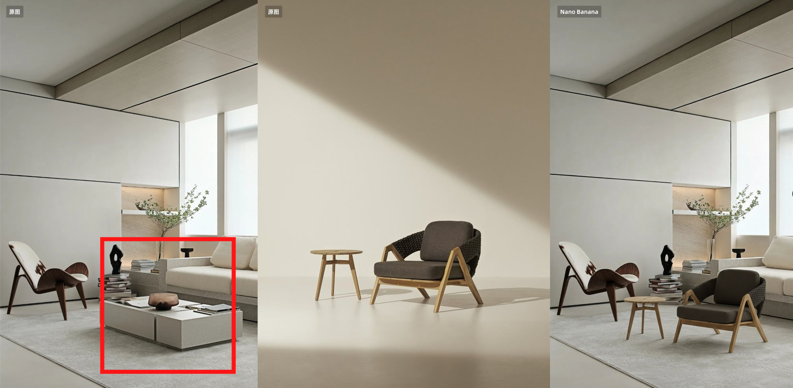
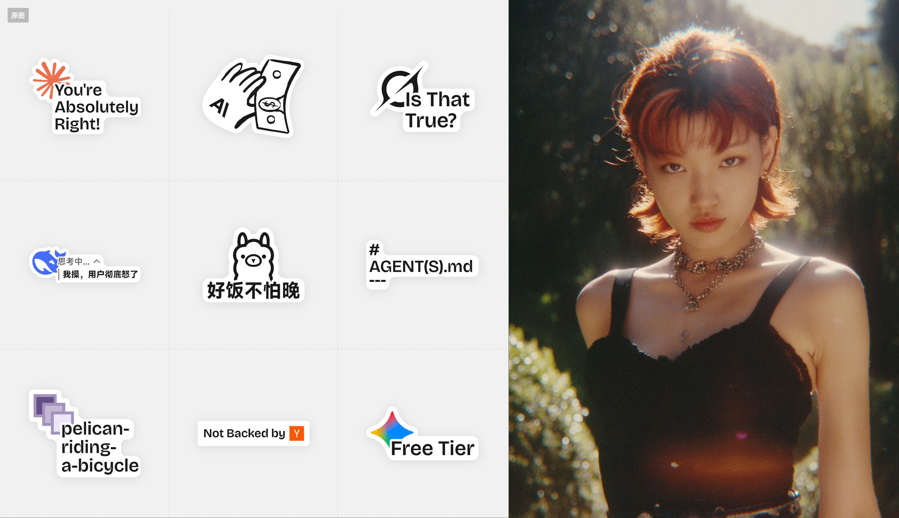
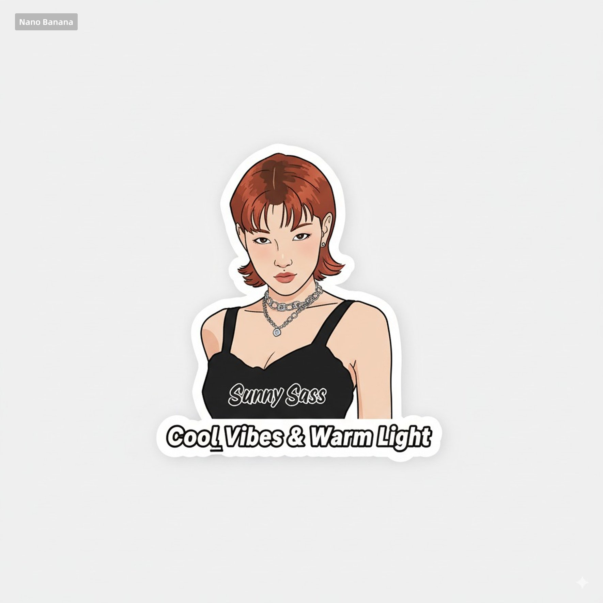
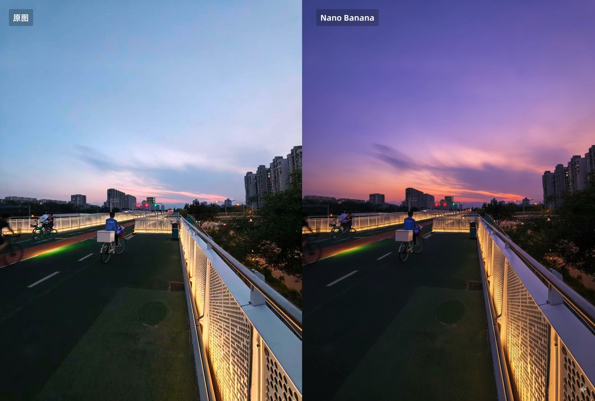
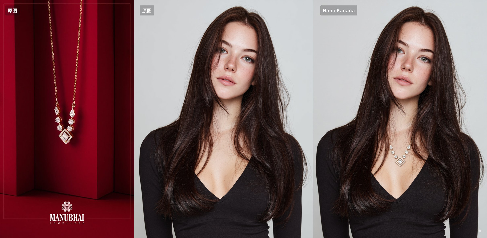
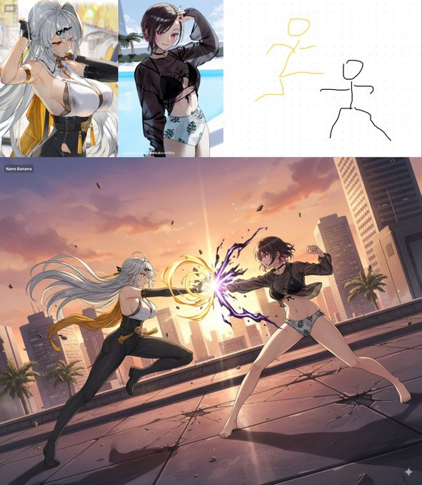

# Awesome Nano Banana 🍌

Awesome curated collection of nano banana strategies, use cases, and tutorials from the SuperMaker AI team. Discover a complete playbook to unlock the full potential of nano banana, from basic setups to complex integrations.


---
## 目录
[Nano Banana介绍](#nano-banana-介绍).

[ 案例目录](#案例目录).

[案例](#案例).

[工具介绍](#工具介绍).

[使用技巧](#使用技巧).

[致谢](#致谢).

---

## Nano Banana 介绍

 纳米香蕉是一个出色的模型巴拉巴拉巴拉巴拉
 
---


##  案例目录

[案例 5：精准换物品 (by @歸藏)](#案例-5精准换物品-by-歸藏)

[案例 4：贴纸生成 (by @歸藏)](#案例-4贴纸生成-by-歸藏)

[案例 3：AI 调色 (by @歸藏)](#案例-3ai-调色-by-歸藏)

[案例 2：虚拟试穿 (by @歸藏)](#案例-2虚拟试穿-by-歸藏)

[案例 1：AI Fighting (by @歸藏)](#案例-1ai-fighting-by-歸藏)


---
## 案例

### 案例 5：精准换物品 (by @歸藏)


[[**原文链接**](https://x.com/op7418/status/1960359622377603231)]

**提示词**
```yaml
Place the chair and table from the first image at the red box location in the second image, and generate the image without the red box markings.
```
**参考图片**



**使用说明**
- 电商利器，商品的 ID 和特征保持的非常牛皮！
- 在第一幅图中圈起需要被替换的物品 在第二幅图放需要替换的物品


---

### 案例 4：贴纸生成 (by @歸藏)


[[**原文链接**](https://x.com/op7418/status/1960385812132192509)]

**提示词**
```yaml
Help me turn the character into a white outline sticker similar to Figure 2. The character needs to be transformed into a web illustration style, and add a playful white outline short phrase describing Figure 1
```
**参考图片**




**使用说明**
- 快速生成可爱的贴纸
- 注意将第一张图片摆为人物 第二张为贴纸


---

### 案例 3：AI 调色 (by @歸藏)


[[**原文链接**](https://x.com/op7418/status/1960528616573558864)]

**提示词**
```yaml
This photo is very boring and plain. Enhance it! Increase the contrast, boost the colors, and improve the lighting to make it richer,You can crop and delete details that affect the composition.
```
**参考图片**



**使用说明**
- 手残党必备 妈妈再也不用担心我不会修图了
- 只需上传一张照片 让 Nano banana 自动帮你调色


---

### 案例 2：虚拟试穿 (by @歸藏)

[[**原文链接**](https://x.com/op7418/status/1960532739469533440)]

**提示词**
```yaml
The woman in Figure 2 is wearing the necklace from Figure 1,Do not change the details of other Figure 2.
```
**参考图片**



**使用说明**
- 电商级别的虚拟试穿
- 解决Flux不知道商品应该多大的问题


---

### 案例 1：AI Fighting (by @歸藏)


[[**原文链接**](https://x.com/op7418/status/1960536717242573181)]

**提示词**
```yaml
Have these two characters fight using the pose from Figure 3.Add appropriate visual backgrounds and scene interactions,Generated image ratio is 16:9
```

**参考图片**



**使用说明**
- Nano Banana 其实支持识别手绘内容
- 精准控制多个角色打斗姿态


---

##  工具介绍

以下是可以使用 nano banana 的相关工具和平台：

* **💻 CLI Tool：** 命令行工具，提供快速配置和部署功能
* **🔧 API SDK：** 官方 SDK，支持多种编程语言集成
* **📊 Dashboard：** Web 管理界面，可视化监控和管理
* **🚀 Cloud Platform：** 云端部署平台，一键部署到生产环境

## 使用技巧

1. [如何优化 nano banana 性能？](https://supermaker.ai/guides/performance) by @SuperMaker
2. [最佳实践指南](https://supermaker.ai/guides/best-practices) by @SuperMaker
3. [故障排除手册](https://supermaker.ai/guides/troubleshooting) by @SuperMaker
4. [高级配置教程](https://supermaker.ai/guides/advanced-config) by @SuperMaker


##  致谢

本案例集的内容很大程度上依赖于 SuperMaker AI 社区分享的创意配置和精彩使用案例。我们向所有案例的贡献者表示诚挚的感谢。😊

特别感谢以下用户分享了他们鼓舞人心的作品 ✨：

* SuperMaker AI Team (@SuperMaker)
* 社区贡献者 (@community)
* 技术专家 (@experts)

如果您的作品被收录在此，而您希望更改署名或将其移除，请随时与我们联系。✉️

---

